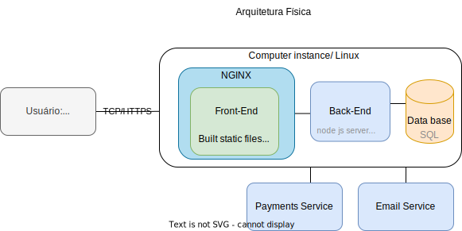
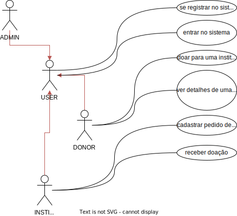

<h2>Documentação</h1>

<h3>Arquitetura</h3>

A arquitetura física é descrita como a Figura 1.

<b>Figura 1</b>. Arquietura física do sistema.

<h3>Casos de uso</h3>

A arquitetura física é descrita como a Figura 2.

<b>Figura 2</b>. Arquietura física do sistema.

<h3>Atualizar a documentação</h3>
* <a href="https://drive.google.com/drive/folders/184X_tmZinF2BZuCKo-UBcNalYfGezciB?usp=share_link"> Link da pasta compartilhada com os arquivos da documentação editáveis.</a>

